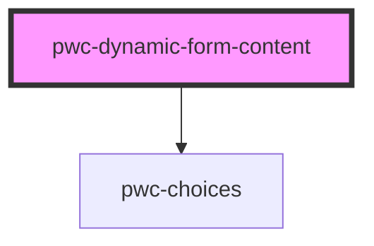

# my-component

<!-- Auto Generated Below -->

## Properties

| Property | Attribute | Description | Type             | Default     |
| -------- | --------- | ----------- | ---------------- | ----------- |
| `config` | `config`  |             | `Root \| string` | `undefined` |

## Dependencies

### Depends on

- pwc-choices

### Graph

----------------------------------------------

*Built with [StencilJS](https://stenciljs.com/)*
