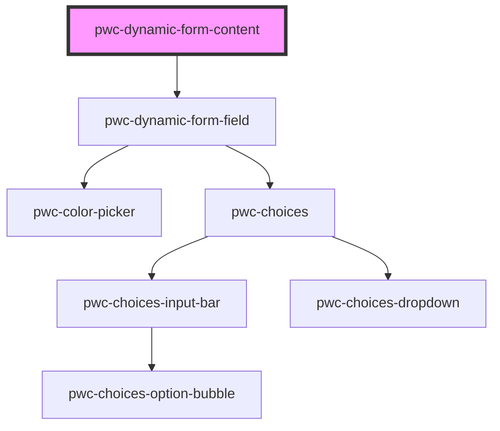

# my-component

<!-- Auto Generated Below -->

## Properties

| Property | Attribute | Description | Type                            | Default     |
| -------- | --------- | ----------- | ------------------------------- | ----------- |
| `items`  | `items`   |             | `ContentItemConfig[] \| string` | `undefined` |

## Methods

### `getFieldRefs() => Promise<HTMLPwcDynamicFormFieldElement[]>`

#### Returns

Type: `Promise<HTMLPwcDynamicFormFieldElement[]>`

## Dependencies

### Depends on

- [pwc-dynamic-form-field](../pwc-dynamic-form-field)

### Graph

----------------------------------------------

*Built with [StencilJS](https://stenciljs.com/)*
