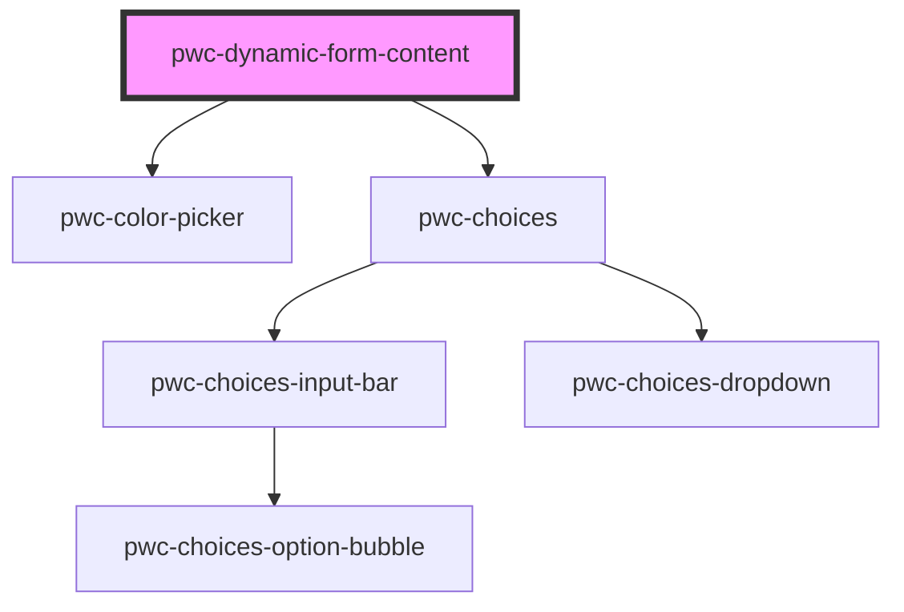

# my-component

<!-- Auto Generated Below -->

## Properties

| Property | Attribute | Description | Type                            | Default     |
| -------- | --------- | ----------- | ------------------------------- | ----------- |
| `items`  | `items`   |             | `ContentItemConfig[] \| string` | `undefined` |

## Events

| Event          | Description | Type                                    |
| -------------- | ----------- | --------------------------------------- |
| `fieldChanged` |             | `CustomEvent<FieldChangedEventPayload>` |

## Methods

### `getChoicesRefs() => Promise<HTMLPwcChoicesElement[]>`

#### Returns

Type: `Promise<HTMLPwcChoicesElement[]>`

### `getColorPickerRefs() => Promise<HTMLPwcColorPickerElement[]>`

#### Returns

Type: `Promise<HTMLPwcColorPickerElement[]>`

### `getNativeInputRefs() => Promise<HTMLInputElement[]>`

#### Returns

Type: `Promise<HTMLInputElement[]>`

## Dependencies

### Depends on

- pwc-color-picker
- pwc-choices

### Graph

----------------------------------------------

*Built with [StencilJS](https://stenciljs.com/)*
