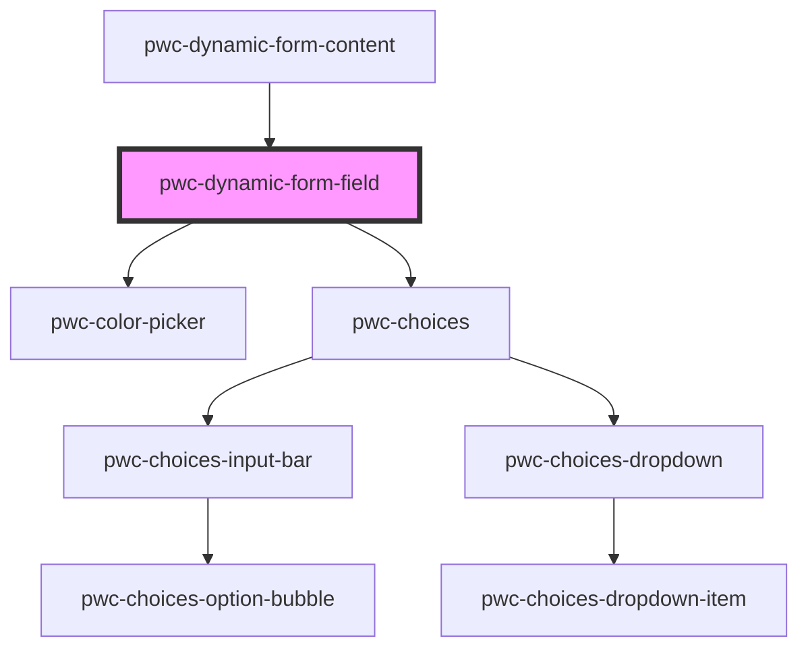

# my-component

<!-- Auto Generated Below -->

## Properties

| Property | Attribute | Description | Type                                                            | Default     |
| -------- | --------- | ----------- | --------------------------------------------------------------- | ----------- |
| `config` | --        |             | `NativeInputConfig \| PwcChoicesConfig \| PwcColorPickerConfig` | `undefined` |

## Events

| Event          | Description | Type                                    |
| -------------- | ----------- | --------------------------------------- |
| `fieldChanged` |             | `CustomEvent<FieldChangedEventPayload>` |

## Methods

### `getValue() => Promise<string | boolean | string[]>`

#### Returns

Type: `Promise<string | boolean | string[]>`

## Dependencies

### Used by

 - [pwc-dynamic-form-content](../pwc-dynamic-form-content)

### Depends on

- pwc-color-picker
- pwc-choices

### Graph

----------------------------------------------

*Built with [StencilJS](https://stenciljs.com/)*
